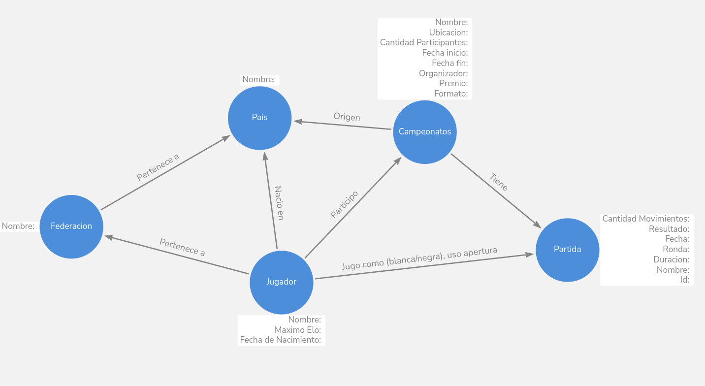

## Campeonato de Ajedrez

## Modelo


## 

para ver todo el grafo:

```
MATCH (n) RETURN n;  
```

## Modelo

## Consultas posibles 
### Básicas

1. **¿De qué país es un jugador?**  
   ```
   MATCH (j:Jugador)-[:TIENE_NACIONALIDAD]->(p:Pais)
   WHERE j.nombre = "Magnus Carlsen"
   RETURN j.nombre AS jugador, p.nombre AS pais;
   ```

2. **¿A qué federación pertenece un jugador?**  
   ```
   MATCH (j:Jugador)-[:PERTENECE_A_FEDERACION]->(f:Federacion)
   WHERE j.nombre = "Magnus Carlsen"
   RETURN j.nombre AS jugador, f.nombre AS federacion;

   ```

3. **¿Qué campeonatos jugó un jugador?**
   ```
   MATCH (j:Jugador)-[:PARTICIPO_EN_CAMPEONATO]->(c:Campeonato)
   WHERE j.nombre = "Magnus Carlsen"
   RETURN j.nombre AS jugador, c.nombre AS campeonato;

   ```

4. **¿Qué partidas pertenecen a un campeonato determinado?**
   ```
   MATCH (c:Campeonato)-[:INCLUYE_PARTIDA]->(p:Partida)
   WHERE c.nombre = "Tata Steel Chess 2024"
   RETURN c.nombre AS campeonato, p.nombre AS partida, p.ronda, p.fecha;
   ```

5. **¿Qué jugadores nacieron en un país específico?**
   ```
   MATCH (j:Jugador)-[:TIENE_NACIONALIDAD]->(p:Pais)
   WHERE p.nombre = "Francia"
   RETURN j.nombre AS jugador, j.fechaNacimiento AS fecha_nacimiento, p.nombre AS pais;
   ```


## Consultas avanzadas 

6. **¿Qué partidas jugó un jugador, con qué color y qué apertura usó?**
   ```
   
   ```

7. **¿Cantidad total de partidas con su tasa de victoria?**
   ```
   
   ```

8. **¿Que aperturas son mas frecuentes para determinado jugador?**
   ```
   
   ```

9. **¿Tasa de victoria frente a determinado (Jugador/Federacion)?**
   ```
   
   ```

10. **¿Quien fue el rival mas frecuente de un jugador?**
   ```
   
   ```