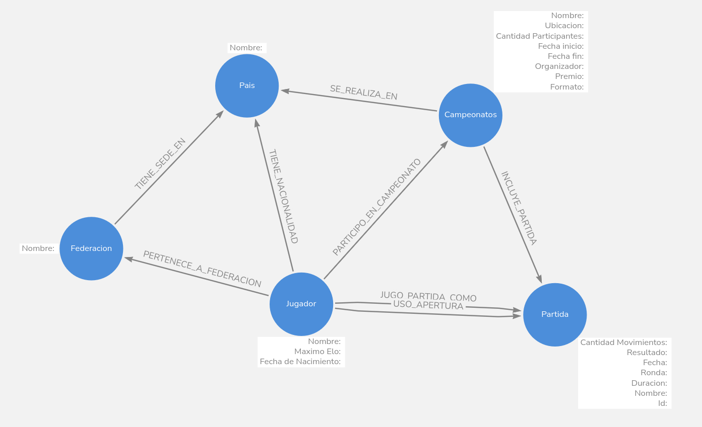

## Campeonato de Ajedrez

## Modelo


##
para ver todo el grafo:

```
MATCH (n) RETURN n;  
```

## Consultas posibles 
### Básicas

1. **¿De qué país es un jugador?**  
   ```
   
   ```

2. **¿A qué federación pertenece un jugador?**  
   ```
   
   ```

3. **¿Qué campeonatos jugó un jugador?**
   ```
   
   ```

4. **¿Qué partidas jugó un jugador, con qué color y qué apertura usó?**
   ```
  
   ```

5. **¿Qué partidas pertenecen a un campeonato determinado?**
   ```
   
   ```

6. **¿Qué jugadores nacieron en un país específico?**
   ```
   
   ```


## Consultas avanzadas 
7. **¿Cantidad total de partidas con su tasa de victoria?**
   ```
   
   ```

8. **¿Que aperturas son mas frecuentes para determinado jugador?**
   ```
   
   ```

9. **¿Tasa de victoria frente a determinado (Jugador/Federacion)?**
   ```
   
   ```

10. **¿Quien fue el rival mas frecuente de un jugador?**
   ```
   
   ```